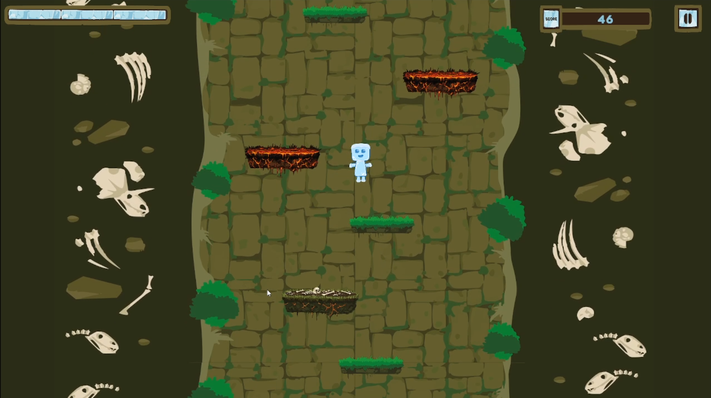

# ❄️ Cry-O – Jeu vidéo

**Cry-O** est un jeu vidéo développé avec Unity et jouable directement dans le navigateur. Réalisé dans le cadre d’une **Game Jam étudiante**, le projet propose une expérience interactive immersive orientée gameplay rapide et accessible.

## 🎮 Jouer au jeu

🔗 https://sarahgadrasgmailcom.itch.io/cry-o

## 📸 Aperçu

## 🧠 Concept

Cry-O est un prototype de jeu web développé durant la **Game Jam 2026** avec comme thème **Température** . Plateformer Die & Retry nerveaux où il faut grimper de plateforme en plateforme dans une course verticale infini. Mais attention, car une lave monte de plus en plus vite en fonction de votre progession.  

## 🛠️ Technologies utilisées

- **Unity** – Développement du jeu
- **HTML5 / WebGL** – Export navigateur
- **C#** – Logique gameplay
- **Itch.io** – Plateforme de publication

## 🚀 Fonctionnalités principales

- 🎮 Jeu jouable directement dans le navigateur
- ⚡ Prototype rapide réalisé en Game Jam
- 🌐 Compatible desktop via WebGL
- 🎥 Trailer et pitch deck disponibles

## 👥 Équipe

- **Lucas Godebout** – Développement & Game Designer
- **Sarah Gadras** - Design Graphique
- **Maëlys Sireude** - Design Graphique & Communication
- **Nathan Garreau** - Marketing et Communication

## 📆 Contexte

Projet créé lors de la **My Digital Jam 2026**, avec l’objectif de concevoir un prototype fonctionnel en temps limité, mettant en pratique les compétences en game design, développement Unity, design et marketing.

## 💡 Pistes d’amélioration

- Version Mobile
- Nouveaux Biomes
- Nouvelles Mécaniques (lianes, trempelins,...)
- Nouveaux Pièges (Chauve-souris, platenforme piègés,...)

## 📄 Licence

Projet étudiant – Tous droits réservés © 2026  
Ce jeu est un prototype réalisé à des fins pédagogiques.

---

> *Prototype développé dans le cadre d’une Game Jam.*
